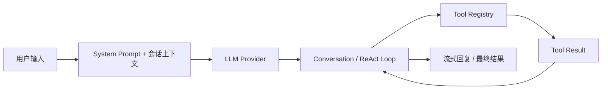
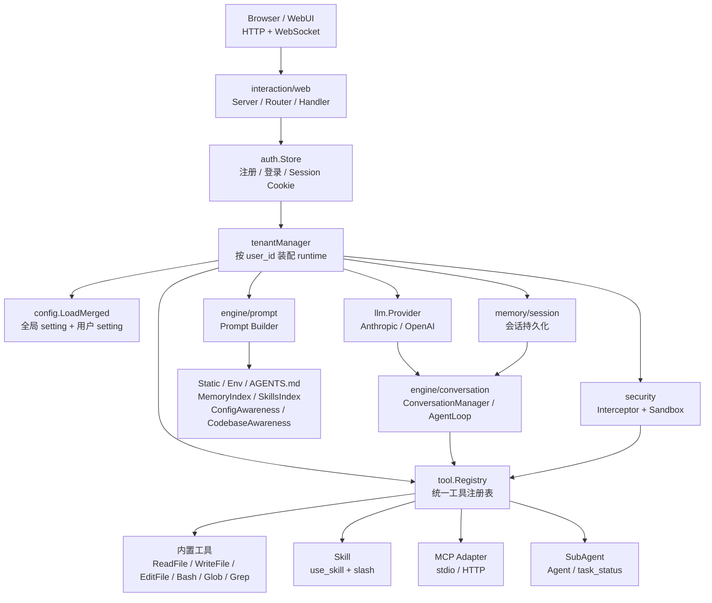
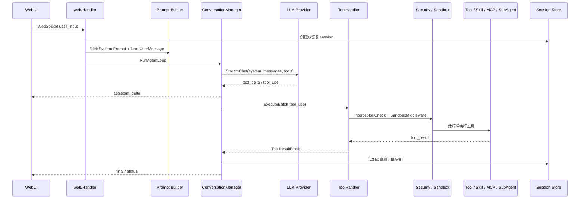
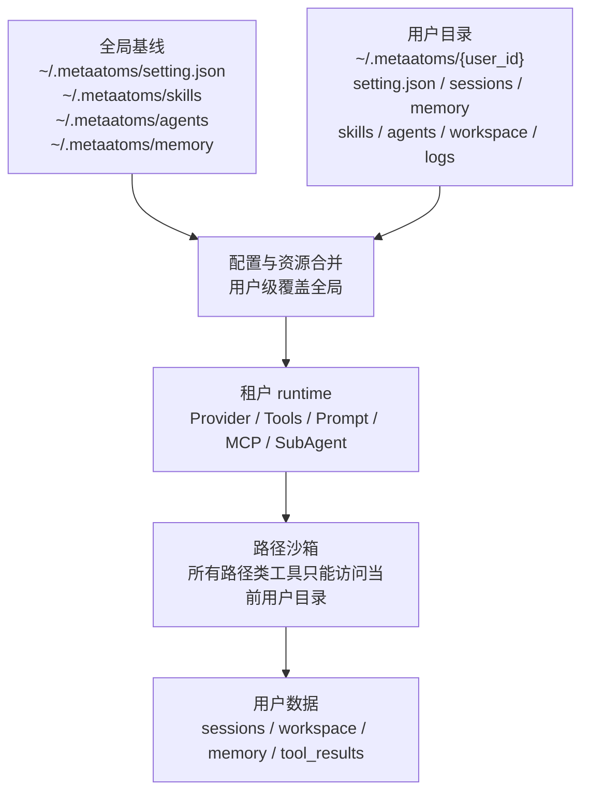
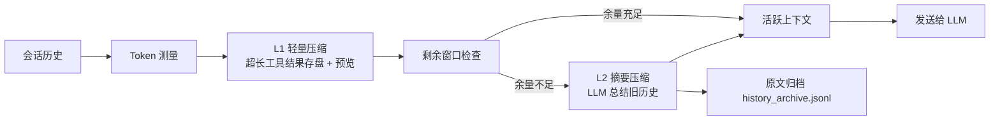
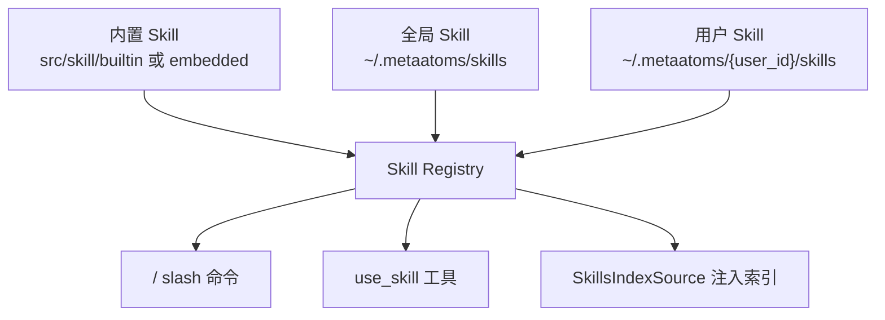
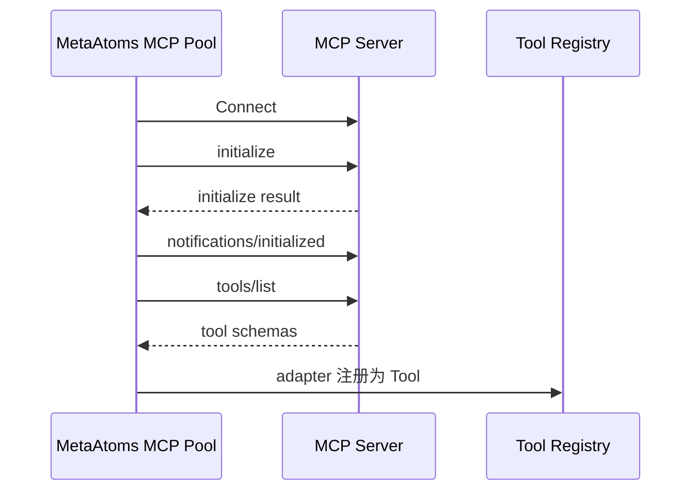
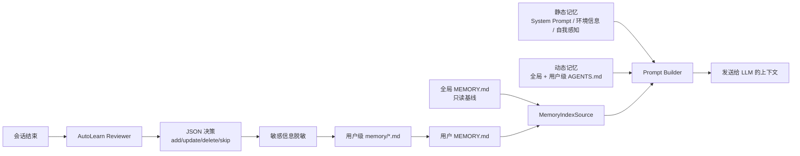
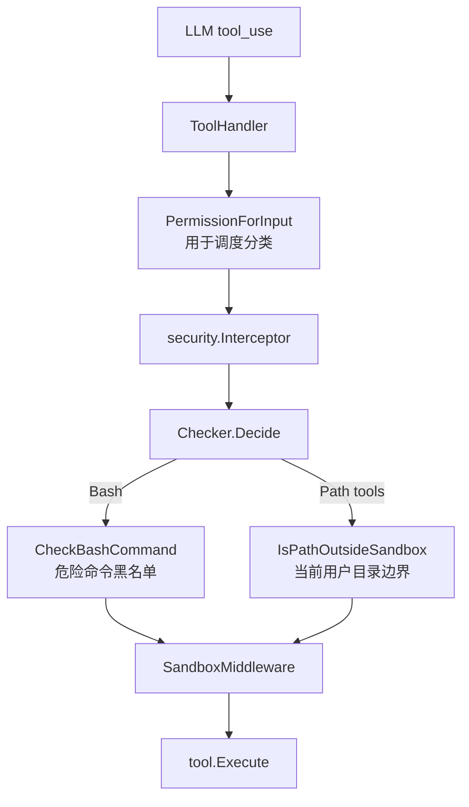
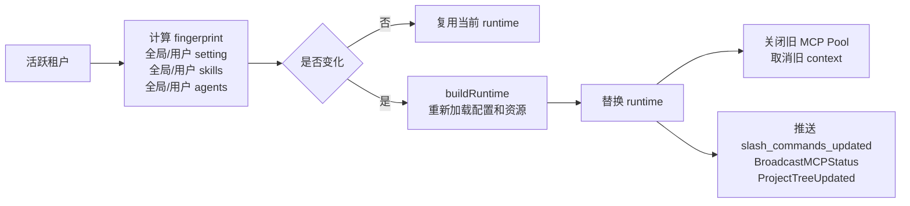

# MetaAtoms

MetaAtoms 是一款面向多租户云端场景的 AI Coding Agent。它参考 [MeiCorl/CodePilot](https://github.com/MeiCorl/CodePilot) 的 Agent 内核链路，保留 LLM Provider、Conversation / ReAct Loop、Tool Registry、Tool Result 回灌、System Prompt 组合等核心抽象，并在此基础上增加 WebUI、登录认证、租户 runtime、租户级数据隔离、MCP / Skill / SubAgent 扩展、长期记忆、自我感知和配置热更新能力。

项目目标是让用户从一个产品想法出发，通过多智能体协作完成需求澄清、架构规划、代码实现、测试、预览和源码交付。当前服务以 HTTP + WebSocket 形式提供浏览器交互入口，用户数据统一落在 `~/.metaatoms/<user_id>/` 下，工具执行与文件访问被限制在当前租户目录内。

MetaAtoms WebUI

## 项目架构

MetaAtoms 的主链路延续 [MeiCorl/CodePilot](https://github.com/MeiCorl/CodePilot) 的设计：




与个人终端助手不同，MetaAtoms 在主链路外增加了云端多租户所需的横切能力：认证、租户 runtime、数据隔离、权限沙箱、用户级配置、Skill / MCP / Agent 自定义、长期记忆和 WebUI 协议层。




### 分层说明


| 层级     | 代码区域                                                                           | 核心职责                                                |
| ------ | ------------------------------------------------------------------------------ | --------------------------------------------------- |
| 交互层    | `src/interaction/web/`                                                         | Web 静态资源、HTTP API、WebSocket 协议、会话列表、流式消息、文件侧栏、预览与下载 |
| 引擎层    | `src/engine/`、`src/llm/`                                                       | Prompt 构建、LLM 适配、ReAct 循环、工具调用调度、终止原因归类             |
| 工具层    | `src/tool/`、`src/skill/`、`src/mcp/`、`src/subagent/`、`src/hook/`、`src/command/` | 内置工具、Skill、MCP、Hook、SubAgent、Slash 命令统一适配为 Agent 能力 |
| 记忆与数据层 | `src/memory/`                                                                  | 会话持久化、上下文压缩、工具结果归档、长期记忆索引和自动学习                      |
| 安全层    | `src/auth/`、`src/security/`                                                    | 登录认证、用户目录隔离、Bash 黑名单、路径沙箱和工具执行前拦截                   |


### 一次请求的数据流




### 多租户数据隔离

MetaAtoms 不再沿用 [MeiCorl/CodePilot](https://github.com/MeiCorl/CodePilot) 的“任意工作区路径”模型，而是固定每个用户的 runtime 根目录。登录后，服务端创建并使用 `~/.metaatoms/<user_id>/` 作为当前用户唯一工作目录。




隔离规则：

- `~/.metaatoms/setting.json` 是平台默认配置；`~/.metaatoms/<user_id>/setting.json` 是用户级覆盖配置。
- `sessions/`、`memory/`、`workspace/`、`logs/`、`skills/`、`agents/` 均按用户分目录。
- 自动学习记忆只写入当前用户目录；全局 `memory/` 只作为只读基线注入。
- `ReadFile`、`WriteFile`、`EditFile`、`Glob`、`Grep` 都经过路径沙箱，不能越过当前用户目录。
- 用户退出或最后一个 WebSocket 关闭后，租户 runtime 会被关闭，MCP 连接池随之释放。


## 运行方法


### 环境要求

- Go `1.26.1`，以 `go.mod` 为准。
- 一个可用的 Anthropic 或 OpenAI API Key。
- 如果启用 stdio MCP 示例，需要本机可执行对应命令，例如 `npx`。


### 基础配置

MetaAtoms 读取 `~/.metaatoms/setting.json` 作为全局启动配置。首次运行前创建配置文件：

```powershell
New-Item -ItemType Directory -Force "$HOME\.metaatoms"
Copy-Item .\config\setting.example.json "$HOME\.metaatoms\setting.json"
notepad "$HOME\.metaatoms\setting.json"
```

至少需要确认：

- `provider`：`anthropic` 或 `openai`
- `model`：对应供应商的模型名
- `api_key`：你的模型 API Key
- `server_port`：Web 服务端口，默认 `8969`

用户注册后会自动创建：

```text
~/.metaatoms/<user_id>/
  setting.json
  sessions/
  logs/
  memory/
  skills/
  agents/
  workspace/
```

用户级 `setting.json` 初始为 `{}`，可只写需要覆盖的字段。

### 源码运行

```powershell
go run .\src
```

启动成功后访问：

```text
http://localhost:8969
```

服务器会监听 `0.0.0.0:<server_port>`，部署到远端机器时把 `localhost` 替换为服务器地址。

### 构建 Windows 可执行文件

```powershell
powershell -ExecutionPolicy Bypass -File .\build\build.ps1
.\Atoms.exe
```

`build/build.ps1` 会生成图标资源并输出根目录下的 `Atoms.exe`。


## 模块功能介绍


### 会话管理

会话系统位于 `src/memory/session/`，负责创建、恢复、列表、删除、消息持久化和历史归档。每个会话目录如下：

```text
~/.metaatoms/<user_id>/sessions/<session_id>/
  meta.json
  messages.jsonl
  history_archive.jsonl
  metaatoms.log
  tool_results/
```

实现原理：

- `SessionManager` 只扫描当前用户的 `sessions/`，不会读取其他用户目录。
- `messages.jsonl` 保存对话历史，`history_archive.jsonl` 保存被摘要压缩前的原文归档。
- `ToolResultStore` 将超长工具结果写入当前会话的 `tool_results/`。
- WebUI 的 `/new`、`/sessions`、`/resume`、`/clear` 等命令都围绕当前用户的 SessionManager 工作。

配置方式：

- 会话路径无需配置，由租户目录自动决定。
- 上下文归档、工具结果归档受 `compaction` 配置影响。


### 上下文管理

上下文管理位于 `src/memory/context/`，负责在模型上下文窗口有限时压缩历史，避免 token 超限。




实现原理：

- L1 轻量压缩将超长工具结果落盘，只在上下文中保留预览和引用。
- L2 摘要压缩在剩余 token 低于阈值时触发，用 LLM 把旧历史总结为结构化摘要。
- Provider 返回 `prompt_too_long` 时会触发紧急压缩，并重试一次。
- 摘要失败按 session 熔断，避免单个会话反复消耗配额。

配置方式：

```json
"compaction": {
  "enabled": true,
  "tool_result_threshold": 8192,
  "preview_tokens": 500,
  "auto_trigger_margin": 13000,
  "manual_target_margin": 3000,
  "keep_recent_tokens": 10000,
  "keep_recent_min_messages": 5,
  "breaker_threshold": 3
}
```


### 工具系统

工具系统位于 `src/tool/` 和 `src/engine/conversation/tool_handler.go`。所有能力都实现统一的 `Tool` 接口，并注册到 `tool.Registry`。

内置工具：

- `ReadFile`
- `WriteFile`
- `EditFile`
- `Bash`
- `Glob`
- `Grep`

实现原理：

- `ToolSpec` 会被转换为 Anthropic / OpenAI 所需的工具 schema。
- `ToolHandler.ExecuteBatch` 按权限类型调度：只读工具可并发，写入和命令执行串行。
- 工具执行前先经过 `security.Interceptor` 和 `SandboxMiddleware`。
- `WriteFile` / `EditFile` 会接入 diff sink，WebUI 可展示文件变更。

配置方式：

```json
"tools": {
  "enabled": ["ReadFile", "WriteFile", "EditFile", "Bash", "Glob", "Grep"]
}
```

`tools.enabled` 为空或省略表示启用所有已注册工具；非空时只暴露白名单内工具。工具名大小写敏感。

### Skill 系统

Skill 系统位于 `src/skill/`，用于把复杂工作流沉淀为可复用能力。一个 Skill 是包含 YAML frontmatter 的 `SKILL.md` 文件，可被用户通过 slash 命令触发，也可由 LLM 通过 `use_skill` 工具按需加载。

加载优先级：




实现原理：

- 内置、全局、用户三档加载，用户级可覆盖同名低优先级 Skill。
- `SKILL.md` 的 frontmatter 提供 `name`、`description`、`args`、`allowed-tools` 等元数据。
- `SkillsIndexSource` 只注入轻量索引，长文档通过 `use_skill` 和 `ReadFile` 渐进加载。
- `embedded://skill/builtin/...` 作为内置只读资源被 `ReadFile` 特例放行。

配置方式：

```json
"skill": {
  "enabled": true,
  "max_skill_size_bytes": 65536
}
```


### MCP 系统

MCP 系统位于 `src/mcp/`，通过 JSON-RPC 2.0 接入外部工具服务器，支持 stdio 和 HTTP 两种 transport。




实现原理：

- 每个租户 runtime 会按合并后的 `mcp.servers[]` 创建连接池。
- 单个 MCP server 失败不会阻塞 MetaAtoms 启动，失败信息进入日志和 WebUI 状态。
- MCP 工具通过 adapter 注册进同一个 `tool.Registry`，复用工具执行、日志、WebUI 展示和安全入口。
- 连接池支持初始化状态、unhealthy 记录和默认指数退避重连。

配置方式：

```json
"mcp": {
  "handshake_timeout_seconds": 30,
  "list_tools_cache_ttl_seconds": 60,
  "servers": [
    {
      "name": "filesystem",
      "type": "stdio",
      "command": "npx",
      "args": ["-y", "@modelcontextprotocol/server-filesystem", "/tmp"],
      "env": {},
      "timeout": 30,
      "disabled": false
    }
  ]
}
```

`type` 支持 `stdio` 和 `http`。用户级 `mcp.servers[]` 非空时会整体覆盖全局数组。

### 记忆系统

记忆系统分为静态记忆和动态记忆。这里的“记忆”不只指长期文件存储，也包括每轮对话前被注入给模型的稳定上下文和可变上下文。

静态记忆：

- System Prompt 静态规则：来自 `StaticSource`，定义 Agent 的基础角色、行为边界、代码工作方式和工具使用规范。
- 环境信息：来自 `EnvironmentSource`，包含 OS、当前用户工作目录、Git 状态、日期、版本等运行时环境。
- 自我感知信息：来自 `ConfigAwarenessSource` 和 `CodebaseAwarenessSource`，告诉 Agent 如何按需读取自身配置和实现文档。
- Skill / Memory 索引等短提示也以“稳定入口”的方式注入，正文细节按需再加载，避免常驻占用上下文。

动态记忆：

- `AGENTS.md` 内容：全局 `~/.metaatoms/AGENTS.md` 与用户级 `~/.metaatoms/<user_id>/AGENTS.md` 会按 H2 段落合并，用户级同名段覆盖全局段。
- 自动学习记忆：Agent Loop 正常结束后，后台 Reviewer 判断本轮对话是否值得长期记住，并写入用户级 `~/.metaatoms/<user_id>/memory`。
- 自动学习当前支持三类记忆：`user_role`、`user_preference`、`user_feedback`。
- 全局 `~/.metaatoms/memory` 可作为只读基线参与索引注入；自动学习写入只落到当前用户目录。
- 写入前会进行敏感信息脱敏，避免 API key、token、密码等落盘。




配置方式：

```json
"memory": {
  "enabled": true,
  "index_max_lines": 200,
  "index_max_bytes": 25600,
  "review_model": ""
}
```

`review_model` 是预留字段，当前实现复用主 provider / 主模型。

### SubAgent

SubAgent 位于 `src/subagent/`，主 Agent 通过稳定的 `Agent` 工具把子任务交给独立子 Agent。子 Agent 使用独立 `ConversationManager`、隔离的权限状态和过滤后的工具视图运行，最终把结构化结果返回主会话或后台任务管理器。

内置角色包括：

- `explore`
- `plan`
- `general-purpose`
- `product-manager`
- `architect`
- `tech-lead`
- `engineer`
- `tester`

实现原理：

- 角色定义是带 YAML frontmatter 的 Markdown 文件。
- 加载顺序为内置、全局、用户级；用户级同名角色覆盖低优先级定义。
- `Agent` 工具支持 defined 和 fork 两类运行方式。
- 前台等待超时后任务可进入后台，`task_status` 可查询状态。
- 后台任务状态通过 WebSocket 推送，并在终态主动回灌主对话。

配置方式：

```json
"subagent": {
  "enabled": true,
  "max_definition_size_bytes": 65536,
  "default_background_timeout_seconds": 300,
  "global_denied_tools": ["Agent", "task_status"],
  "background_allowed_tools": ["ReadFile", "Glob", "Grep", "Bash"]
}
```

自定义角色放在：

```text
~/.metaatoms/<user_id>/agents/*.md
~/.metaatoms/agents/*.md
```


### 多租户隔离

多租户能力由 `src/auth/`、`tenantManager`、`config.LoadMerged` 和 `security` 共同完成。

实现原理：

- `auth.Store` 保存用户数据到 `~/.metaatoms/user_data.dat`，登录成功后写入 `metaatoms_session` HttpOnly Cookie。
- 每个登录用户按 `user_id` 创建独立 runtime。
- runtime 包含独立 Provider、SessionManager、ToolRegistry、ToolHandler、PromptBuilder、MCP Pool、SubAgent Runner。
- 用户目录固定为 `~/.metaatoms/<user_id>`，工具工作目录也被强制设置为该路径。
- 最后一个 WebSocket 关闭时，该用户 runtime 会从缓存移除并关闭。

配置方式：

- 全局默认：`~/.metaatoms/setting.json`
- 用户覆盖：`~/.metaatoms/<user_id>/setting.json`
- 用户资源：`skills/`、`agents/`、`memory/`、`workspace/`


### 权限系统

当前权限系统已经收敛为固定安全边界，不再支持旧版 `permissions` 配置段，也不再支持 `allow / ask / deny`、HITL 权限确认弹窗或规则写回。

实现原理：




保留的安全能力：

- Bash 命令执行前经过硬编码危险命令黑名单。
- 路径类工具必须访问当前用户目录内路径。
- `SandboxMiddleware` 会规范化路径并注入绝对路径，防止工具实现绕过。
- `embedded://skill/builtin/...` 仅对内置 Skill 只读资源放行。
- 非路径、非 Bash 工具默认允许；是否暴露给 LLM 由 `tools.enabled`、MCP 配置和 SubAgent 工具过滤决定。

配置方式：

- 不要写 `permissions` 字段。
- 控制主 Agent 工具可见性：使用 `tools.enabled`。
- 控制 MCP 能力暴露：调整 `mcp.servers[]` 或配合 `tools.enabled`。
- 控制子 Agent 能力：使用角色 frontmatter 的 `allowed-tools` / `denied-tools` 和 `subagent.global_denied_tools`。


### 自我感知系统

自我感知系统让 Agent 知道 MetaAtoms 自身的配置方式和实现原理，避免用户询问“你是怎么实现的”时只能泛泛回答。

实现原理：

- `ConfigAwarenessSource` 注入配置自感知，指向 `config-management` Skill。
- `CodebaseAwarenessSource` 注入代码自感知，指向 `codebase-overview` Skill。
- 两个 Source 都是短文本，只告诉 Agent 应按需使用 Skill 和 reference 文档。
- `config-management` 负责说明 `setting.json`、Skill、Agent、Memory 等配置。
- `codebase-overview` 负责说明架构、会话、工具、MCP、权限、上下文、记忆、SubAgent 等实现。
- 长文档采用“索引 + 按需子文档”二级加载，避免常驻占用上下文。

配置方式：

```json
"skill": {
  "enabled": true,
  "max_skill_size_bytes": 65536
}
```

即使 `skill.enabled=false`，静态自感知 Source 仍会注入，但 Agent 将无法通过 `use_skill` 读取详细文档。

### 配置热更新

MetaAtoms 已实现租户 runtime 级别的热重建。`tenantManager` 会为活跃用户计算 fingerprint，并在配置或资源变化后重建该用户 runtime。




触发方式：

- WebSocket 打开或收到消息时，会即时检查当前用户 runtime 是否需要刷新。
- 后台定时器每 `30s` 对活跃租户做一次自动刷新。
- fingerprint 覆盖 `~/.metaatoms/setting.json`、用户级 `setting.json`、全局/用户 `skills/`、全局/用户 `agents/`。
- 用户 `workspace/`、`memory/`、`setting/skills/agents` 的文件树变化会推送给右侧文件面板。

注意事项：

- `server_port` 是全局 Web Server 启动参数，变更后仍需要重启进程。
- 用户级配置、Skill、Agent 的变化可通过 runtime 热重建生效。
- 如果热重建失败，系统保留旧 runtime 并记录 warning，避免中断当前用户会话。


### Hook 系统

Hook 系统位于 `src/hook/`，可在 Agent 生命周期事件上执行 command、http、prompt 或 agent action。

支持事件：

- `program_start`
- `program_exit`
- `compact`
- `error`
- `session_start`
- `session_end`
- `iteration_start`
- `iteration_end`
- `pre_tool_use`
- `post_tool_use`
- `pre_message`
- `post_message`

配置方式：

```json
"hook": {
  "enabled": true,
  "entries": [
    {
      "name": "auto-gofmt",
      "event": "post_tool_use",
      "condition": {
        "all": [
          { "field": "tool_name", "op": "eq", "value": "WriteFile" },
          { "field": "tool_input.file_path", "op": "glob", "value": "*.go" }
        ]
      },
      "action": {
        "type": "command",
        "command": "gofmt -w $TOOL_INPUT_FILE_PATH",
        "timeout": "10s"
      },
      "async": false,
      "once": false
    }
  ]
}
```


## 完整 `setting.json` 配置

下面是当前项目支持的完整配置模板，可作为 `~/.metaatoms/setting.json` 或 `~/.metaatoms/<user_id>/setting.json` 的参考。用户级配置可以只保留需要覆盖的字段。

```json
{
  "provider": "anthropic",
  "server_port": 8969,
  "model": "claude-sonnet-4-20250514",
  "base_url": "",
  "api_key": "sk-ant-your-api-key-here",
  "max_tokens": 16384,
  "timeout": 180,
  "max_retries": 2,
  "tools": {
    "enabled": ["ReadFile", "WriteFile", "EditFile", "Bash", "Glob", "Grep"]
  },
  "tool_execution_timeout_seconds": 30,
  "tool_working_directory": "",
  "context_window_size": 200000,
  "max_agent_loop_iterations": 50,
  "context_safety_margin": 4096,
  "mcp": {
    "handshake_timeout_seconds": 30,
    "list_tools_cache_ttl_seconds": 60,
    "servers": [
      {
        "name": "filesystem",
        "type": "stdio",
        "command": "npx",
        "args": ["-y", "@modelcontextprotocol/server-filesystem", "/tmp"],
        "env": {},
        "timeout": 30,
        "disabled": false
      },
      {
        "name": "github",
        "type": "stdio",
        "command": "npx",
        "args": ["-y", "@modelcontextprotocol/server-github"],
        "env": {
          "GITHUB_PERSONAL_ACCESS_TOKEN": "ghp_replace_with_your_token"
        },
        "timeout": 60,
        "disabled": false
      },
      {
        "name": "remote-mcp",
        "type": "http",
        "url": "https://example.com/mcp",
        "headers": {
          "Authorization": "Bearer your-token-here"
        },
        "timeout": 30,
        "disabled": true
      }
    ]
  },
  "compaction": {
    "enabled": true,
    "tool_result_threshold": 8192,
    "preview_tokens": 500,
    "auto_trigger_margin": 13000,
    "manual_target_margin": 3000,
    "keep_recent_tokens": 10000,
    "keep_recent_min_messages": 5,
    "breaker_threshold": 3
  },
  "memory": {
    "enabled": true,
    "index_max_lines": 200,
    "index_max_bytes": 25600,
    "review_model": ""
  },
  "skill": {
    "enabled": true,
    "max_skill_size_bytes": 65536
  },
  "subagent": {
    "enabled": true,
    "max_definition_size_bytes": 65536,
    "default_background_timeout_seconds": 300,
    "global_denied_tools": ["Agent", "task_status"],
    "background_allowed_tools": ["ReadFile", "Glob", "Grep", "Bash"]
  },
  "hook": {
    "enabled": true,
    "entries": [
      {
        "name": "auto-gofmt",
        "event": "post_tool_use",
        "condition": {
          "all": [
            { "field": "tool_name", "op": "eq", "value": "WriteFile" },
            { "field": "tool_input.file_path", "op": "glob", "value": "*.go" }
          ]
        },
        "action": {
          "type": "command",
          "command": "gofmt -w $TOOL_INPUT_FILE_PATH",
          "working_dir": "",
          "env": {
            "NO_COLOR": "1"
          },
          "timeout": "10s"
        },
        "async": false,
        "once": false
      },
      {
        "name": "security-audit",
        "event": "session_start",
        "condition": null,
        "action": {
          "type": "agent",
          "role": "explore",
          "prompt": "请扫描当前项目，识别最近会话中可能被改动的高风险文件路径，以 JSON 列表返回。",
          "max_iterations": 1,
          "allow_tools": ["ReadFile", "Grep"],
          "timeout": "60s"
        },
        "async": true,
        "once": true
      }
    ]
  }
}
```

字段补充：

- `tool_working_directory` 是兼容字段；云端多用户模式下运行时会被强制设为 `~/.metaatoms/<user_id>`。
- `server_port` 只影响全局 Web Server，建议只放在全局配置。
- `permissions` 字段已移除，不要加入配置。
- `mcp.servers[]`、`hook.entries[]` 这类数组在用户级配置中会整体覆盖全局数组。
